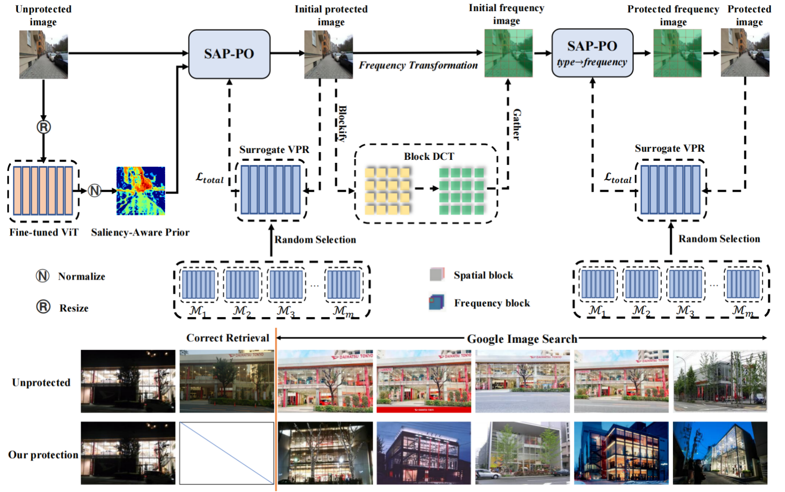

# VPR-Cloak

This repository provides a PyTorch implementation of **VPR-Cloak**, from the following paper

[VPR-Cloak](https://arxiv.org/abs/2512.10938)  \
Shuting Dong*, [Mingzhi Chen*](https://mingzhic.com/), [Feng Lu](https://github.com/Lu-Feng), Hao Yu, Guanghao Li, [Ming Tang](https://mingtang.site/), and [Chun Yuan](https://www.sigs.tsinghua.edu.cn/yc2_en/main.psp) \
Tsinghua University, Pengcheng Laboratory, Southern University of Science and Technology [[`paper`](https://openaccess.thecvf.com/content/ICCV2025/html/Dong_VPR-Cloak_A_First_Look_at_Privacy_Cloak_Against_Visual_Place_ICCV_2025_paper.html)]

--- 

**VPR-Cloak** is an efficient privacy-preserving framework that generates imperceptible, transferable adversarial perturbations to protect location privacy against black-box visual place recognition systems in real-world scenarios.

